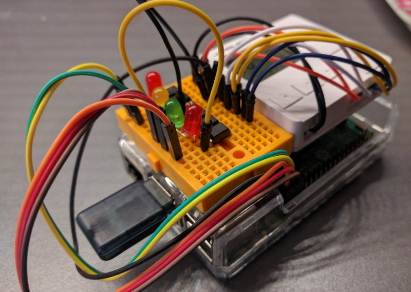
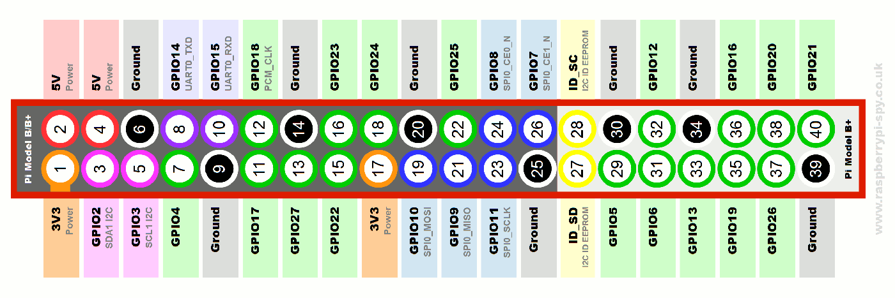

# Pi remote shutter controller interface
Hack your home shutter controller, compatible for Raspberry GPIO outputs.
This program will run a web server enabling you to control hom shutter like remove controller.

Some manufacturers does not allow you to control you shutters via your own RF antenna and your computer.
If you are totally stuck when pairing your remote control because of an unkown hardware encryption, 
you may be interested to exploit hardware buttons and transform your remote into a new web interface.

Here is an example of pi remote:




### How to run

- [x] Install `nodejs` and `npm` on your Raspberry.
- [x] Edit JSON configuration in `config.js` for your controller
- [x] Run this program as a cron, you must give root privileges for GPIO control


```bash
# In project folder
npm install
npm start
```

To set this program as a daemon you have to start it as a service, 
you can use `supervisord` for this or create an `/etc/init.d/` daemon.


## Open / close / stop one or several shutter
Use those function using the following url

To open rolling shutter on channel 1:
```curl
http://localhost:8086/1/open
```

To stop the shutter on channel 1 and 2:
```curl
http://localhost:8086/1,2/stop
```

To close half way all your shutters above 4:
```curl
http://localhost:8086/1,2,3,4/-50
```

To open a little bit more (10%) your shutter 1 
```curl
http://localhost:8086/1/+10
```

To avoid a desynchronization of the remote / PI as there are no input, 
an idle state is triggered after a few seconds and reset to the default channel 1.


## Channel configuration
If you have a controller with multiple channels, it is necessary to link **at least one button** on the Raspberry:
- the next channel (`next` button) to increment channel pointer
- the previous channel (`prev` button) to decrement channel pointer

The prev button is optional and depends of your controller, set `config.gpio.prev: false` to disable the *prev* button.

Program is compatible with unique channel, just call `/1/action`


## Example of hacked remote controller
I tested this program to control Jarolift shutters with a **Jarolift `TDRC-08W`** controller (8 channels), 
for which I solded wires and connected them to an easy breadboard.

Every buttons need two wires, and are connected to an **optocoupler**.
The optocoupler is linked from the GPIO to the ground of the Raspberry.


You can use the GPIO of the Raspberry you want, set those in the configuration:


